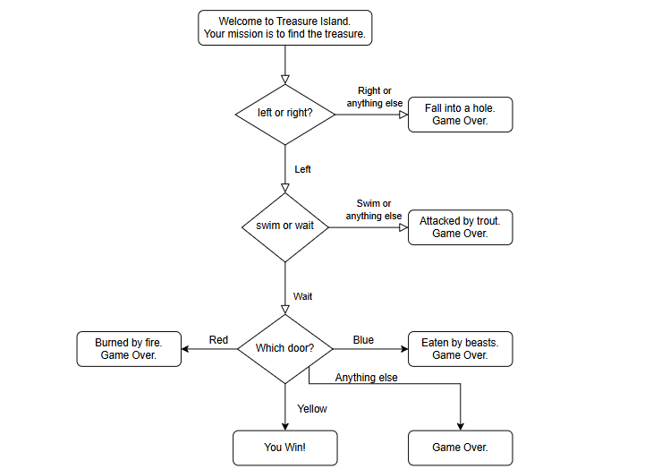
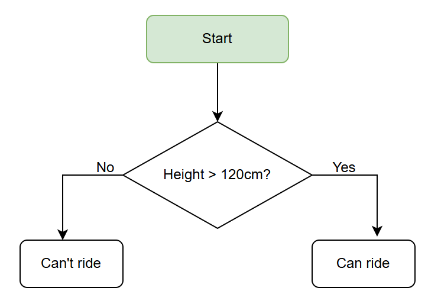
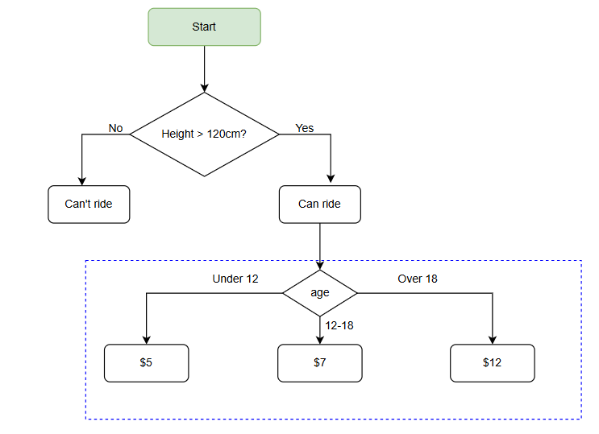
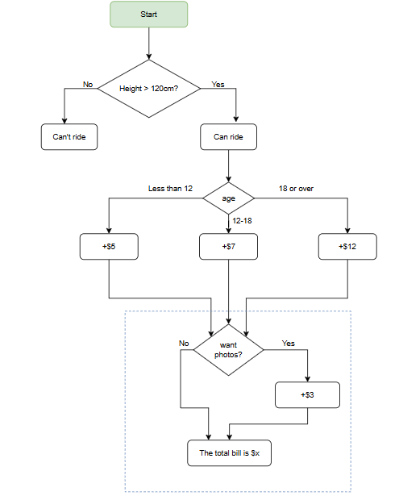
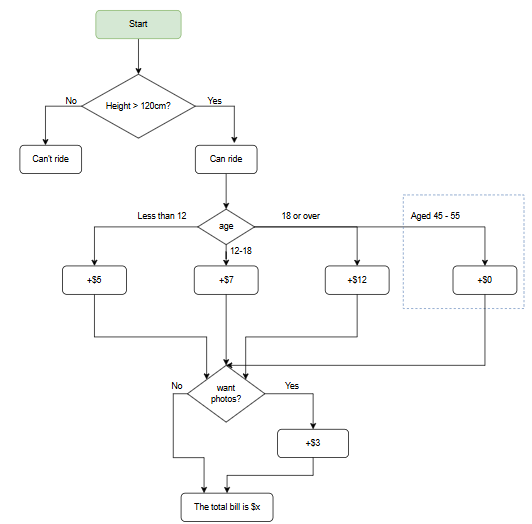

# Assignment: If/Else and Nested If/Else Control Flow Practice

## Beginner Level - Game-Based Learning

---

## **PART 1: TREASURE ISLAND ADVENTURE GAME**

### If/Else Decision Making

Text-based adventure games use decision trees to create branching storylines. Each choice leads to different outcomes. This teaches sequential decision-making and if/else logic.



### Game Flow (Based on Flowchart)

```python
Welcome to Treasure Island!
Your mission is to find the treasure.

Decision 1: left or right? → If Left, continue. Otherwise → Fall into a hole. Game Over.

Decision 2 (if Left): swim or wait? → If Wait, continue. Otherwise → Attacked by trout. Game Over.

Decision 3 (if Wait): Which door? (red/blue/yellow)
  - If Red → Burned by fire. Game Over.
  - If Yellow → You Win!
  - Otherwise (Blue) → Eaten by beasts. Game Over.
```

### Assignment Requirements

**Level 1: Basic Structure**


Create a text-based adventure game that implements the above flowchart. Your program should:

1. Welcome the player and set the scene
2. Ask "Do you go left or right?"
    - If player chooses "right" or anything else → Print "You fall into a hole. Game Over."
    - If player chooses "left" → Continue to next decision
3. Ask "Do you swim or wait?"
    - If player chooses "swim" or anything else → Print "You are attacked by a trout. Game Over."
    - If player chooses "wait" → Continue to next decision
4. Ask "Which door do you choose? (red/blue/yellow)"
    - If player chooses "red" → Print "You are burned by fire. Game Over."
    - If player chooses "blue" → Print "You are eaten by beasts. Game Over."
    - If player chooses "yellow" → Print "You found the treasure! You Win!"
    - Otherwise → Print "Invalid choice. Game Over."
5. Make input case-insensitive (e.g., "LEFT", "Left", "left" all work)

### Sample Output

```python
=== WELCOME TO TREASURE ISLAND ===
Your mission is to find the treasure.

You are on a beach with a strange island ahead. You see a path splitting into two directions.

Do you go left or right? left
You go left. The path opens to a river.

Do you swim or wait? wait
You wait by the river. Suddenly, you hear mysterious sounds...

A cave reveals three doors: one glowing red, one deep blue, one bright yellow.
Which door do you choose? (red/blue/yellow) yellow

⭐ CONGRATULATIONS! ⭐
You found the treasure and escaped the island!
=== GAME OVER ===
```

### Sample Output (Game Over Scenario)

```python
=== WELCOME TO TREASURE ISLAND ===
Your mission is to find the treasure.

Do you go left or right? right
You fall into a hole!
Game Over. Try again!
```

### Hints

- Use `input()` to get player choices
- Use `.lower()` to convert input to lowercase for easier comparison
- Use simple `if-elif-else` statements (not nested yet)
- Use `print()` with descriptive messages for each outcome
- You can add ASCII art or emojis to make it more fun

---

## **PART 2: Rollercoaster Pricing System - 4 Stages**

## **OVERVIEW: The Four Stages**

This assignment takes you through four progressive stages of building a rollercoaster ticket booking system. Each stage adds complexity to practice nested if/else statements.

| Stage | Focus | New Features |
| --- | --- | --- |
| **Stage 0** | Basic If/Else | Height validation only |
| **Stage 1** | Nested If/Else | Height + Age-based pricing |
| **Stage 2** | Complex Nesting | Height + Age + Photo add-ons |
| **Stage 3** | Advanced Nesting | Height + Age + Photos + Senior discount |

---

## **STAGE 0: HEIGHT CHECK ONLY**

### Basic If/Else (No Nesting Yet)

### Flowchart Logic



```
Start
  ↓
Height > 120cm?
  ├─ No → Can't ride
  └─ Yes → Can ride

```

### Theme Park Overview:

Theme parks first check if a rider meets the minimum height requirement for safety reasons. This is the entry point to the system.

### Assignment Requirements

Create a simple program that:

1. Asks the user for their height (in cm)
2. If height is 120cm or less:
    - Print "Can't ride"
    - Add a safety message
3. If height is greater than 120cm:
    - Print "Can ride"
    - Add an encouraging message

### Sample Output (Can Ride)

```
=== ROLLERCOASTER BOOKING ===
What is your height (in cm)? 145
✓ Great! You can ride this rollercoaster!

```

### Sample Output (Can't Ride)

```
=== ROLLERCOASTER BOOKING ===
What is your height (in cm)? 110
✗ Sorry, you are too short to ride.
Minimum height required: 120cm

```

### Key Concepts

- Simple if/else statement
- Comparison operator (>)
- Input and type conversion

---

## **STAGE 1: HEIGHT + AGE-BASED PRICING**

### Introduction to Nested If/Else

### Flowchart Logic



```
Start
  ↓
Height > 120cm?
  ├─ No → Can't ride
  └─ Yes → Can ride
          ↓
        Age?
        ├─ Less than 12 → $5
        ├─ 12-18 → $7
        └─ 18 or over → $12

```

### Theme Park Overview:

Once the height requirement is met, the system checks age to determine appropriate pricing. Children pay less, teenagers pay regular price, adults pay full price.

### Assignment Requirements

Building on Stage 0, add:

1. Check height (same as Stage 0)
2. If height check passes, ask for age
3. Determine price based on age:
    - Age < 12: $5
    - Age 12-18: $7
    - Age 18+: $12
4. Display the determined price

### Sample Output (Child)

```
=== ROLLERCOASTER BOOKING ===
What is your height (in cm)? 130
✓ Great! You can ride this rollercoaster!

How old are you? 10
Age group: Child (Under 12)
Ticket price: $5

```

### Sample Output (Teenager)

```
=== ROLLERCOASTER BOOKING ===
What is your height (in cm)? 145
✓ Great! You can ride this rollercoaster!

How old are you? 16
Age group: Teenager (12-18)
Ticket price: $7

```

### Sample Output (Adult)

```
=== ROLLERCOASTER BOOKING ===
What is your height (in cm)? 175
✓ Great! You can ride this rollercoaster!

How old are you? 28
Age group: Adult (18+)
Ticket price: $12

```

### Key Concepts

- **First level of nesting**: if inside if
- **Elif statements**: for multiple conditions within nested if
- **Range checking**: age <= 18
- **Variable assignment**: based on condition

---

## **STAGE 2: HEIGHT + AGE + PHOTO ADD-ONS**

### More Complex Nested If/Else

### Flowchart Logic



```
Start
  ↓
Height > 120cm?
  ├─ No → Can't ride
  └─ Yes → Can ride
          ↓
        Age?
        ├─ Less than 12 → $5
        ├─ 12-18 → $7
        └─ 18 or over → $12
          ↓
        Want photos?
        ├─ No → Total = base price
        └─ Yes → Total = base price + $3
          ↓
        Display total bill

```

### Theme Park Overview:

Theme parks offer optional photo packages to capture memories. This adds an additional conditional layer, charging extra for those who want photos.

### Assignment Requirements

Building on Stage 1, add:

1. All Stage 1 requirements (height and age-based pricing)
2. Ask "Do you want to buy photos?" (yes/no)
3. If yes: Add $3 to the base ticket price
4. Display itemized bill showing:
    - Base ticket price
    - Photo cost (if applicable)
    - Total cost

### Sample Output (Without Photos)

```
=== ROLLERCOASTER BOOKING ===
What is your height (in cm)? 140
✓ Great! You can ride this rollercoaster!

How old are you? 14
Age group: Teenager (12-18)
Base ticket price: $7

Do you want to buy photos? (yes/no) no

==== YOUR BILL ====
Ticket: $7
Photos: $0
────────────
Total: $7

```

### Sample Output (With Photos)

```
=== ROLLERCOASTER BOOKING ===
What is your height (in cm)? 155
✓ Great! You can ride this rollercoaster!

How old are you? 8
Age group: Child (Under 12)
Base ticket price: $5

Do you want to buy photos? (yes/no) yes

==== YOUR BILL ====
Ticket: $5
Photos: +$3
────────────
Total: $8

```

### Key Concepts

- **Two levels of nesting**: if within if within if
- **String methods**: .lower() for case-insensitive comparison
- **Conditional variable assignment**: photo_cost based on choice
- **Calculation within nested conditions**: total price calculation
- **Formatted output**: itemized bill display

---

## **STAGE 3: COMPLETE SYSTEM WITH SENIOR DISCOUNT**

### Advanced Nested If/Else with Special Cases

### Flowchart Logic



```
Start
  ↓
Height > 120cm?
  ├─ No → Can't ride
  └─ Yes → Can ride
          ↓
        Age?
        ├─ Less than 12 → $5
        ├─ 12-18 → $7
        ├─ 45-55 (Senior) → $0 ⭐ SPECIAL
        └─ 18 or over → $12
          ↓
        Want photos?
        ├─ No → Total = base price
        └─ Yes → Total = base price + $3
          ↓
        Display itemized bill

```

### Theme Park Overview:

Many theme parks offer special senior discounts for age groups 45-55 as part of their pricing strategy. This requires checking for a range within the existing age logic.

### Assignment Requirements

Building on Stage 2, add:

1. All Stage 2 requirements (height, age, photos)
2. Add a special case for seniors (age 45-55):
    - They get a FREE RIDE ($0)
    - This overrides the normal pricing
    - They still can buy photos for +$3
3. Display a special celebration message for seniors
4. Show itemized bill with all details

### Sample Output (Senior with Photos)

```
=== ROLLERCOASTER BOOKING ===
What is your height (in cm)? 160
✓ Great! You can ride this rollercoaster!

How old are you? 50
Age group: Senior (45-55)
🎉 SPECIAL DISCOUNT! 🎉
Your ride is completely FREE!

Do you want to buy photos? (yes/no) yes

==== YOUR BILL ====
Ticket: $0 (Senior Discount!)
Photos: +$3
────────────
Total: $3
Thank you for celebrating with us!

```

### Sample Output (Senior without Photos)

```
=== ROLLERCOASTER BOOKING ===
What is your height (in cm)? 162
✓ Great! You can ride this rollercoaster!

How old are you? 48
Age group: Senior (45-55)
🎉 SPECIAL DISCOUNT! 🎉
Your ride is completely FREE!

Do you want to buy photos? (yes/no) no

==== YOUR BILL ====
Ticket: $0 (Senior Discount!)
Photos: $0
────────────
Total: $0
Thank you for celebrating with us!

```

### Sample Output (Regular Adult with Photos)

```
=== ROLLERCOASTER BOOKING ===
What is your height (in cm)? 170
✓ Great! You can ride this rollercoaster!

How old are you? 35
Age group: Adult (18+)
Ticket price: $12

Do you want to buy photos? (yes/no) yes

==== YOUR BILL ====
Ticket: $12
Photos: +$3
────────────
Total: $15

```

### Key Concepts

- **Range checking within elif**: 45 - 55 range
- **Multiple nested conditions**: 3+ levels deep
- **Conditional string messages**: special_message variable
- **Complex logic flow**: multiple paths with different outcomes
- **Edge case handling**: special senior discount logic

---

## **PROGRESSION CHALLENGE: COMBINING ALL STAGES**

### Complete Interactive System

Once you've completed all four stages individually, create a **complete system** that:

1. **Processes multiple customers** in a loop
2. **Tracks statistics**:
    - Total customers processed
    - Total revenue collected
    - Number of seniors who rode free
    - Number of photo packages sold
3. **Handles input validation**:
    - Check if inputs are valid numbers
    - Check if height/age are reasonable values
4. **Provides detailed reports** at the end

### Complete System Sample Output

```
=== ROLLERCOASTER BOOKING SYSTEM ===
Welcome to the ultimate theme park experience!

Customer 1
──────────
What is your height (in cm)? 135
✓ Great! You can ride this rollercoaster!

How old are you? 10
Age group: Child (Under 12)
Ticket price: $5

Do you want to buy photos? (yes/no) yes

==== YOUR BILL ====
Ticket: $5
Photos: +$3
────────────
Total: $8

Process another customer? (yes/no) yes

Customer 2
──────────
What is your height (in cm)? 165
✓ Great! You can ride this rollercoaster!

How old are you? 50
Age group: Senior (45-55)
🎉 SPECIAL DISCOUNT! 🎉
Your ride is completely FREE!

Do you want to buy photos? (yes/no) no

==== YOUR BILL ====
Ticket: $0 (Senior Discount!)
Photos: $0
────────────
Total: $0
Thank you for celebrating with us!

Process another customer? (yes/no) no

=== SESSION SUMMARY ===
Total Customers Processed: 2
Total Revenue: $8
Photo Packages Sold: 1
Senior Free Rides: 1
Average Revenue per Customer: $4.00
Thank you for visiting!

```

---

## **PRACTICE PROGRESSION CHECKLIST**

- [ ]  **Stage 0**: Write and test height check program
- [ ]  **Stage 1**: Add age-based pricing to Stage 0
- [ ]  **Stage 2**: Add photo option to Stage 1
- [ ]  **Stage 3**: Add senior discount to Stage 2
- [ ]  **Challenge**: Create complete multi-customer system
- [ ]  **Extra**: Add error handling for invalid inputs

---

## **Debugging Tips**

❌ **Problem**: "Syntax Error: invalid syntax"

✅ **Solution**: Check your indentation! Python requires proper indentation for nested blocks.

❌ **Problem**: Senior discount not working

✅ **Solution**: Make sure the senior check comes BEFORE the general "18+" check in your elif chain.

❌ **Problem**: Photos not adding to total

✅ **Solution**: Remember to initialize `photo_cost = 0` before the photo check.

❌ **Problem**: Program crashes on non-numeric input

✅ **Solution**: Add try/except blocks to handle ValueError.

---

## **Learning Path Summary**

**Stage 0**: Learn basic if/else

→ **Stage 1**: Learn first level of nesting

→ **Stage 2**: Learn deeper nesting

→ **Stage 3**: Learn complex conditions and ranges

→ **Challenge**: Combine everything with loops and data tracking

**Congratulations!** By completing all stages, you'll have mastered:
✅ Simple if/else statements

✅ Nested if/else logic

✅ Elif chains and conditions

✅ Range checking (and operator)

✅ Error handling

✅ Real-world application design